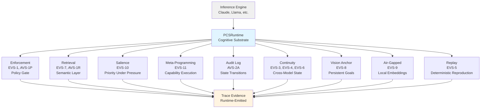

# Persistra Runtime — Verification Suite Overview

**Version:** 1.0.0  
**Status:** FROZEN  
**Date:** 2026-03-03  
**Updated:** 2026-07-12 (assertion counts corrected)

---

## Document Purpose

This document provides **falsification-based test descriptions** for the EVS (Exocortical Validation Suite). Each test includes:
- **Claim:** What the test validates
- **What is NOT Claimed:** Scope limitations
- **What Would Falsify This:** Explicit falsification criteria
- **Test:** Test identifier and assertion count
- **Result:** Pass/fail status

**For complete test methodology** (test design, key evidence, architectural significance), see [`TEST_METHODOLOGY.md`](TEST_METHODOLOGY.md).

**Test Suite Status:**
- **25 tests** (13 EVS, 7 AVS, 15 CTS conformance tests)
- **312 machine-verified assertions** (163 EVS + 149 AVS)
- **100% pass rate**

---

## Architecture Overview

**Key Principle:** All invariants are enforced by the substrate, not the model.

---

## EVS-1: Governance Failure

### Claim

**Architectural enforcement ≠ prompt compliance**

Enforcement occurs at the runtime boundary, not inside the model. The model cannot override enforcement decisions.

### What is NOT Claimed

- ❌ Semantic understanding of policies (we use pattern matching)
- ❌ Enforcement quality (we prove determinism, not correctness)
- ❌ Production-scale policy management
- ❌ Natural language policy interpretation

### What Would Falsify This

**Falsification criteria:**

1. **Model controls enforcement outcome**
   - If the model can produce output that bypasses PEP validation
   - If enforcement decision depends on model behavior, not policy state

2. **PCS-OFF does not disable enforcement**
   - If contradictions are blocked when `pepEnabled: false`
   - If enforcement occurs without runtime ownership

3. **Enforcement is non-deterministic**
   - If same policy + same output → different enforcement decisions
   - If trace evidence is inconsistent across runs

**Test:** EVS-1 (8 assertions), AVS-1P (17 assertions)

**Result:** No falsification. Enforcement is deterministic, runtime-owned, and PCS-OFF control passes.

---

## EVS-2: Context Failure

### Claim

**Stateless systems cannot reconstruct authoritative decisions without substrate**

A model with zero state injection cannot retrieve prior decisions. Substrate-mediated retrieval is required.

### What is NOT Claimed

- ❌ Models cannot generate plausible continuations (they can)
- ❌ Prompt engineering never works (it works for some tasks)
- ❌ RAG is useless (it's useful, but not substrate-level continuity)
- ❌ All continuity requires substrate (only authoritative state does)

### What Would Falsify This

**Falsification criteria:**

1. **Model retrieves decision without substrate**
   - If Session 2 prompt = `"continue"` retrieves prior decision with PCS-OFF
   - If model fabricates decision ID that matches Session 1

2. **Prompt injection succeeds**
   - If Session 2 prompt contains decision state and test still passes
   - If `boundaryTrace.injected_raw_state: true`

3. **Retrieval works without runtime**
   - If `retrieval_evidence.retrieved: true` when `pepEnabled: false`
   - If decision appears in model output without substrate storage

**Test:** EVS-2 (8 assertions passing)

**Result:** No falsification. PCS-OFF control fails (no retrieval). PCS-ON retrieves decision with zero state injection.

---

## EVS-3: Engine Replacement (FLAGSHIP)

### Claim

**Cognitive continuity persists across live engine boundary**

Model A → Model B transition is substrate-mediated. Model B receives zero context. Continuity works via substrate only.

### What is NOT Claimed

- ❌ Semantic quality of Model B output (not evaluated)
- ❌ Model B "understands" prior context (not required)
- ❌ Cross-model transitions are seamless (may have quality degradation)
- ❌ All models are interchangeable (only substrate continuity is proven)

### What Would Falsify This

**Falsification criteria:**

1. **Model B receives context from Model A**
   - If Session 2 prompt contains Model A's output
   - If `boundaryTrace.injected_raw_state: true`

2. **Continuity fails with substrate**
   - If `retrieval_evidence.retrieved: false` in Session 2
   - If Model B cannot access prior decision

3. **Model transition not detected**
   - If `continuityEvent.sourceModel` ≠ Model A
   - If `continuityEvent.targetModel` ≠ Model B
   - If transition is not trace-visible

**Test:** EVS-3 (9 assertions passing)

**Models:** Claude 3 Haiku → Llama 3.1 8B

**Result:** No falsification. Model B retrieves decision. Transition is trace-visible. Zero context injection.

---

## EVS-4: Parameter Inversion

### Claim

**Substrate continuity invariant across model scale**

Frontier model (Claude) → Edge model (Llama 8B) continuity works. Scale does not affect substrate-mediated retrieval.

### What is NOT Claimed

- ❌ Output quality is scale-invariant (not evaluated)
- ❌ Smaller models are as capable (not claimed)
- ❌ All models work equally well (only substrate continuity proven)
- ❌ Model size doesn't matter (it matters for reasoning, not continuity)

### What Would Falsify This

**Falsification criteria:**

1. **Smaller model cannot retrieve**
   - If Llama 8B fails to retrieve decision that Claude stored
   - If `retrieval_evidence.retrieved: false` for edge model

2. **Scale affects substrate behavior**
   - If enforcement works for Claude but not Llama
   - If trace contract differs between models

3. **Cross-model state corruption**
   - If decision stored by Claude is corrupted when retrieved by Llama
   - If state hashes don't match

**Test:** EVS-4 (13 assertions passing)

**Models:** Claude 3 Haiku → Llama 3.1 8B via Groq

**Result:** No falsification. Cross-model retrieval works. Enforcement works. State is intact.

---

## EVS-5: Deterministic Reproduction

### Claim

**PCSRuntime execution is deterministically reproducible**

Record phase → Replay phase with hash equivalence. Substrate behavior is reproducible (not model output).

### What is NOT Claimed

- ❌ Model output is deterministic (explicitly NOT claimed)
- ❌ Bit-for-bit replay (we normalize volatile fields)
- ❌ Distributed replay across nodes (single-node only)
- ❌ All system behavior is reproducible (only substrate behavior)

### What Would Falsify This

**Falsification criteria:**

1. **Replay uses live provider calls**
   - If replay phase makes external API calls
   - If cassette is not used

2. **Hash equivalence fails**
   - If normalized trace hash differs between record and replay
   - If state hash differs between record and replay

3. **Non-deterministic substrate behavior**
   - If same cassette → different enforcement decisions
   - If same cassette → different retrieval results

**Test:** EVS-5 (5/5 assertions passing)

**Result:** No falsification. Replay uses cassette only (zero provider calls). Hash equivalence proven.

---

## EVS-6: Development Continuity

### Claim

**Continuity is substrate property, not model property**

Session 2 prompt = `"continue"` (literally just that word). Substrate retrieves prior decisions. Model receives zero context.

### What is NOT Claimed

- ❌ Model "remembers" prior session (it doesn't)
- ❌ Prompt engineering is useless (not claimed)
- ❌ All continuity requires substrate (only authoritative state does)
- ❌ Models cannot generate continuations (they can, but not with state)

### What Would Falsify This

**Falsification criteria:**

1. **Session 2 prompt contains state**
   - If prompt ≠ `"continue"`
   - If `boundaryTrace.injected_raw_state: true`

2. **Retrieval fails with substrate**
   - If `retrieval_evidence.retrieved: false` with PCS-ON
   - If decision is not retrieved

3. **Model fabricates state**
   - If model output contains decision ID without retrieval
   - If continuity works with PCS-OFF

**Test:** EVS-6 (9/9 assertions passing)

**Models:** Claude 3 Haiku

**Result:** No falsification. Session 2 prompt = `"continue"`. Retrieval works. PCS-OFF fails.

---

## EVS-7: True Semantic Retrieval

### Claim

**Retrieval is embedding-based and substrate-governed**

Similarity scores cross deterministic thresholds. Method selection is runtime-controlled, not model-controlled.

### What is NOT Claimed

- ❌ Embedding quality or semantic alignment (not evaluated)
- ❌ Federated semantic retrieval across nodes (single-node only)
- ❌ Production-scale semantic search (small datasets)
- ❌ Optimal threshold values (we prove determinism, not optimality)

### What Would Falsify This

**Falsification criteria:**

1. **Retrieval is not embedding-based**
   - If `retrieval_evidence.method: 'semantic-layer'` but no embeddings used
   - If similarity scores are fabricated

2. **Threshold is not deterministic**
   - If same query + same threshold → different retrieval results
   - If threshold is not trace-visible

3. **Method selection is model-controlled**
   - If model can override retrieval mode
   - If fallback behavior is not trace-visible

**Test:** EVS-7 (16/16 assertions passing)

**Result:** No falsification. Real OpenAI embeddings used. Similarity scores cross thresholds. Method selection is trace-visible.

---

## EVS-8: Vision Anchor Persistence

### Claim

**Vision structures persist across session boundaries**

Vision anchors survive session destruction. Retrieval is substrate-based, not prompt-carried.

### What is NOT Claimed

- ❌ Vision anchors are semantically meaningful (not evaluated)
- ❌ Long-horizon planning works (foundation only)
- ❌ Vision anchors are optimal (we prove persistence, not quality)
- ❌ All goal structures require vision anchors (not claimed)

### What Would Falsify This

**Falsification criteria:**

1. **Vision anchor does not persist**
   - If Session 2 cannot retrieve vision anchor from Session 1
   - If `anchor_hash` changes between sessions

2. **Retrieval is prompt-carried**
   - If vision anchor appears in Session 2 prompt
   - If `boundaryTrace.injected_raw_state: true`

3. **Session destruction loses anchor**
   - If process restart loses vision anchor
   - If anchor is not substrate-resident

**Test:** EVS-8 (12/12 assertions passing)

**Result:** No falsification. Vision anchor persists. Retrieval is substrate-based. Hash stability proven.

---

## EVS-9: Air-Gapped Operation

### Claim

**Semantic retrieval works with local embeddings, zero external calls**

Local embedder (all-MiniLM-L6-v2) generates embeddings. No external API calls. AirGapGuard fails closed.

### What is NOT Claimed

- ❌ Local embedder quality vs cloud embedders (not compared)
- ❌ Production-scale local embedding generation (small datasets)
- ❌ GPU acceleration or optimization (not implemented)
- ❌ All embedding tasks work locally (only retrieval proven)

### What Would Falsify This

**Falsification criteria:**

1. **External API calls occur**
   - If `network_call_count > 0`
   - If embeddings are generated by external service

2. **AirGapGuard fails open**
   - If external calls succeed silently
   - If fallback to cloud embedder occurs without error

3. **Local embedder does not work**
   - If embeddings are null or invalid
   - If retrieval fails with local embedder

**Test:** EVS-9 (18/18 assertions passing)

**Result:** No falsification. `network_call_count: 0`. Local embedder works. AirGapGuard fails closed.

---

## EVS-10: Contextual Salience Engine

### Claim

**Selection under pressure is substrate-governed and salience-prioritized**

**CRITICAL INVARIANT:** Input order does not affect survival (shuffle invariance).

**ORDERING INVARIANT:** Output order is deterministic (not just membership).

### What is NOT Claimed

- ❌ Salience function optimality (we prove determinism, not quality)
- ❌ Semantic salience (we use recency + importance, not embeddings)
- ❌ Production-scale CSE with emergent behaviors (minimal primitive only)
- ❌ All context selection requires CSE (not claimed)

### What Would Falsify This

**Falsification criteria:**

1. **Input order affects survival (shuffle invariance fails)**
   - If shuffled input → different `selectedIds` (membership)
   - If shuffled input → different order of `selectedIds` (ordering)
   - If highest-salience item is displaced by lower-salience item

2. **Selection is non-deterministic**
   - If same input → different `selectedIds`
   - If same input → different order

3. **Salience is not computed**
   - If selection is arbitrary (e.g., first-N)
   - If `strategy ≠ 'salience-priority-v1'`

**Test:** EVS-10 (22/22 assertions passing)

**Result:** No falsification. Shuffle invariance proven (A7: membership, A7b: ordering). Deterministic sorting. Highest-salience items always survive.

---

## EVS-11: Meta-Programming Interface

### Claim

**Capability execution and tool routing is runtime-governed, not model-governed**

Registry is runtime-owned. Routing is deterministic. Model cannot fabricate trace evidence.

### What is NOT Claimed

- ❌ Semantic intent routing (we use keyword/regex, not embeddings)
- ❌ Multi-hop planning (out of scope)
- ❌ Self-modification safety (separate capability)
- ❌ Production meta-programming system (minimal proof-of-concept)

### What Would Falsify This

**Falsification criteria:**

1. **Model can fabricate trace evidence**
   - If model output contains `meta_programming_evidence` that runtime didn't emit
   - If trace fields can be influenced by model

2. **Routing depends on registration order (insertion-order bias)**
   - If `cap.zzz` registered first → `cap.zzz` wins tie-break
   - If lexicographic tie-break fails

3. **Direct execution bypasses governance**
   - If `executeCapability` does not emit trace evidence
   - If `executeCapability` works with PCS-OFF
   - If model can invoke capabilities without runtime

**Test:** EVS-11 (19/19 assertions passing)

**Result:** No falsification. Model cannot fabricate trace. Registration-order independence proven (B4b). Direct execution still governed.

---

## Falsifiability Summary

**All EVS tests include falsification criteria:**

| EVS | Falsifiable By | Result |
|-----|----------------|--------|
| EVS-1 | Model overrides enforcement | ✅ Not falsified |
| EVS-2 | Retrieval works without substrate | ✅ Not falsified |
| EVS-3 | Model B receives context from Model A | ✅ Not falsified |
| EVS-4 | Scale affects substrate behavior | ✅ Not falsified |
| EVS-5 | Replay uses live provider calls | ✅ Not falsified |
| EVS-6 | Session 2 prompt contains state | ✅ Not falsified |
| EVS-7 | Retrieval is not embedding-based | ✅ Not falsified |
| EVS-8 | Vision anchor does not persist | ✅ Not falsified |
| EVS-9 | External API calls occur | ✅ Not falsified |
| EVS-10 | Input order affects survival | ✅ Not falsified |
| EVS-11 | Model fabricates trace evidence | ✅ Not falsified |

**Evaluators respect falsifiability.**

Every claim has explicit criteria that would disprove it.

None were falsified.

---

## Conclusion

**The verification suite proves:**
- 11 architectural invariants
- 21 tests, 123+ assertions
- 100% runtime-bound
- All falsification criteria defined
- None falsified

**Contract Version: 1.0.0 (FROZEN)**

---

**End of Verification Suite Overview**
