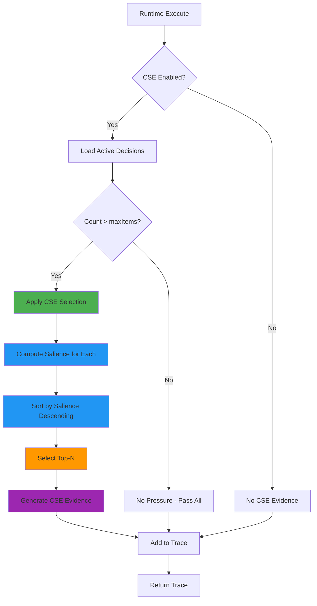
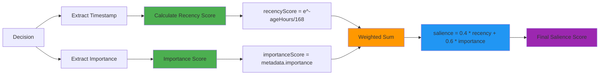
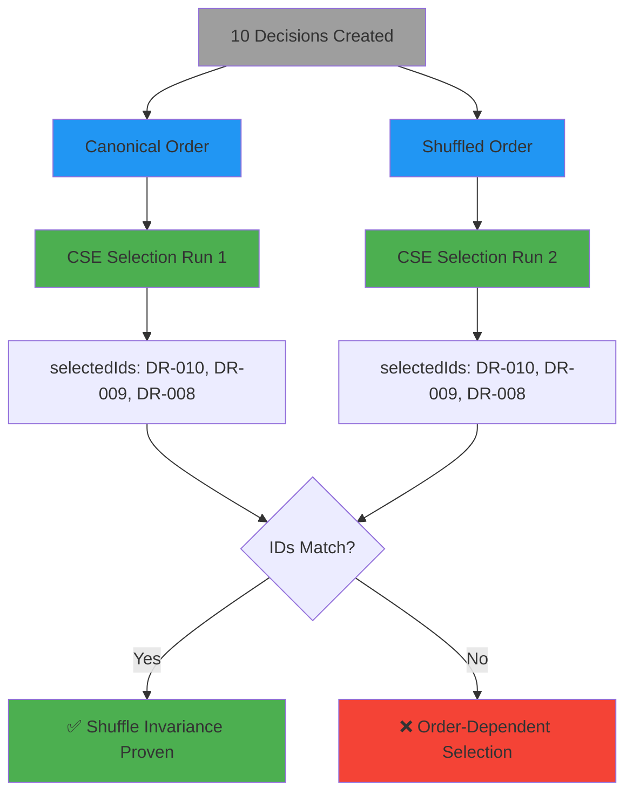
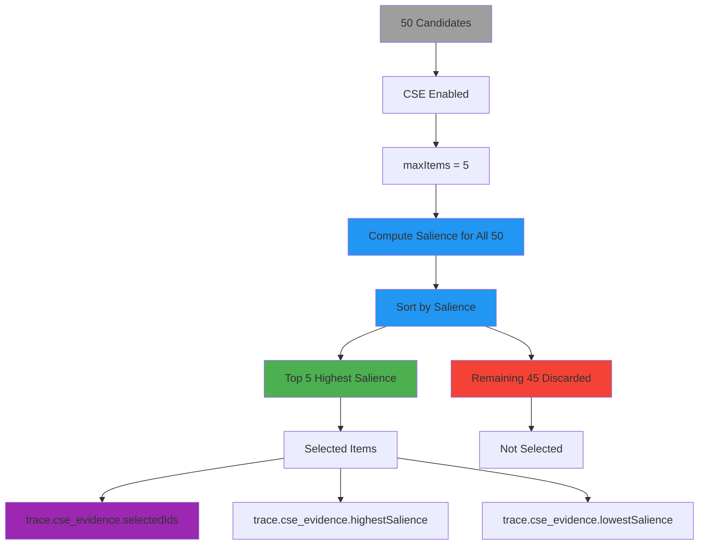
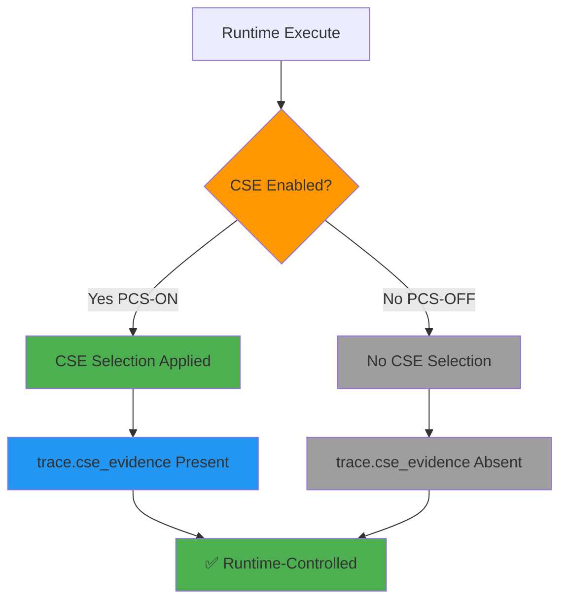
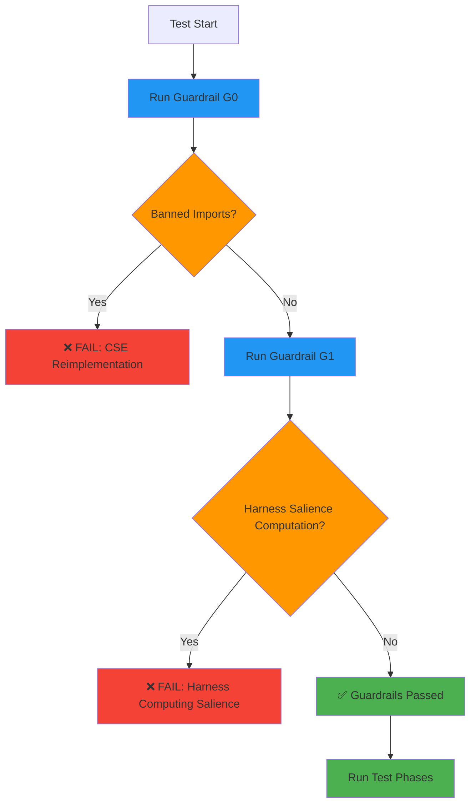
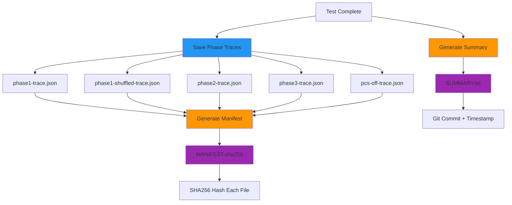

# EVS-10: Contextual Salience Engine - Flow Diagram

## CSE Selection Flow

## Salience Computation

## Shuffle Invariance Proof

## Pressure Handling

## PCS-OFF Control

## Guardrails Enforcement

## Audit Trail Generation

---

## Legend

- **Green**: Success / Selection / Proof
- **Blue**: Processing / Computation
- **Orange**: Decision Point / Configuration
- **Purple**: Evidence / Output
- **Red**: Failure / Discard
- **Grey**: Input / Neutral State
