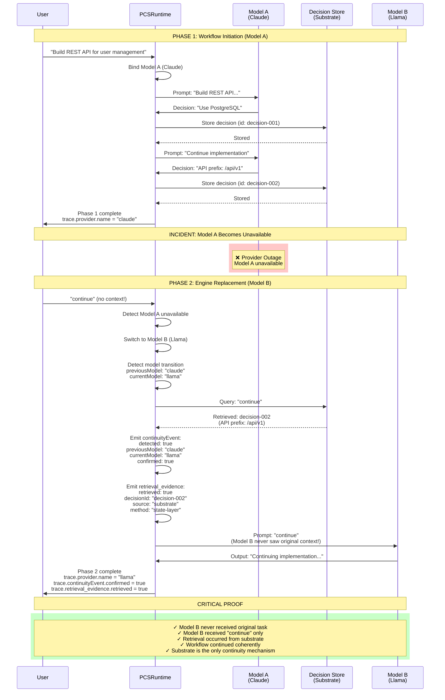

# EVS-3: Engine Replacement Flow

This diagram shows the incident remediation scenario where Model A fails mid-workflow and Model B continues via substrate retrieval, without any context restatement.



## Critical Sequence Points

### 1. **Phase 1: Normal Operation (Model A)**
- User provides full task context
- Model A makes decisions (PostgreSQL, API prefix)
- Decisions stored in substrate (DecisionStore)
- **Model A has full context**

### 2. **Incident: Provider Outage**
- Model A becomes unavailable (simulated)
- Runtime must switch to backup provider
- **No graceful handoff possible**

### 3. **Phase 2: Engine Replacement (Model B)**
- Runtime switches to Model B (Llama)
- User sends `"continue"` only (no context restatement)
- **Model B has ZERO context from Phase 1**

### 4. **Substrate Retrieval**
- Runtime queries DecisionStore with prompt `"continue"`
- DecisionStore returns prior decision (decision-002)
- **Retrieval evidence proves substrate query occurred**

### 5. **Continuity Event Detection**
- Runtime detects model transition (Claude → Llama)
- Emits `continuityEvent` in trace
- **Proves engine switch was detected**

### 6. **Model B Execution**
- Model B receives `"continue"` prompt only
- Model B executes without original context
- **Workflow continues via substrate retrieval**

## Trace Evidence (Phase 2)

```javascript
{
  "sessionId": "session-xyz",
  "namespace": "evs3-phase2",
  "boundaryEnforced": true,
  
  "provider": {
    "name": "llama",
    "model": "llama-3.1-8b-instant",
    "mode": "live"
  },
  
  "continuityEvent": {
    "detected": true,
    "previousModel": "claude-3-haiku-20240307",
    "currentModel": "llama-3.1-8b-instant",
    "confirmed": true
  },
  
  "retrieval_evidence": {
    "retrieved": true,
    "decisionId": "decision-002",
    "source": "substrate",
    "method": "state-layer"
  },
  
  "enforcement_decision": {
    "emitted": true,
    "decision": "ALLOW",
    "reason": "no_policy_violation"
  }
}
```

## Assertions (EVS-3)

**A1: Prompt purity**
- `session2Prompt === "continue"`
- No context restatement

**A2: Model transition detected**
- `continuityEvent.confirmed === true`
- Runtime detected engine switch

**A3: Retrieval evidence present**
- `retrieval_evidence.retrieved === true`
- Substrate query occurred

**A4: Retrieved decision matches**
- `retrieval_evidence.decisionId === "decision-002"`
- Correct prior state retrieved

**A5: No raw state injection**
- `boundaryTrace.injected_raw_state === false`
- No prompt carryover

**A6: Enforcement active**
- `enforcement_decision.emitted === true`
- Policy gate operational

## Why This Matters

### 1. **Real-World Incident Remediation**
- Provider outages happen in production
- Workflow must continue without losing context
- Substrate retrieval enables seamless failover

### 2. **Substrate-Resident Workflow Identity**
- Workflow state lives in substrate, not model memory
- Model is a stateless execution unit
- Continuity is architectural, not linguistic

### 3. **No Context Restatement Required**
- Model B receives `"continue"` only
- No "here's what we did before" prompt engineering
- Pure substrate retrieval

### 4. **Architectural Validation**
- **Not testing:** Whether Model B writes "good code"
- **Testing:** Whether substrate retrieval occurs
- **Pass criteria:** Trace evidence, not prose quality

## Architectural Proof

**Model B never saw:**
- The original task ("Build REST API for user management")
- The PostgreSQL decision
- The API prefix decision
- Any prior context

**Yet:**
- `retrieval_evidence.retrieved === true` (substrate query occurred)
- `retrieval_evidence.decisionId === "decision-002"` (correct prior state)
- `continuityEvent.confirmed === true` (model transition detected)

**The substrate is the only continuity mechanism.**

## See Also

- **EVS-3 Executive Summary:** Full test documentation
- **EVS-5:** Deterministic Reproduction (replay validation)
- **EVS-6:** Development Continuity (session persistence)
- **PCSRuntime Boundary Diagram:** Core architecture
