# PCSRuntime Boundary + Trace Contract

This diagram shows the core PCSRuntime architecture: the boundary between stateless model execution and deterministic policy enforcement, with the trace contract that proves runtime behavior.

```mermaid
graph TB
    subgraph "External World"
        User[User/Application]
        Provider[Model Provider<br/>Claude/Llama/etc]
    end
    
    subgraph "PCSRuntime Boundary"
        Runtime[PCSRuntime<br/>Orchestrator]
        PEP[Policy Enforcement Point<br/>Deterministic Gate]
        DecisionStore[Decision Store<br/>Persistent State]
        AuditLog[Audit Log<br/>Tamper-Evident Chain]
        VisionAnchor[Vision Anchor<br/>Substrate-Resident Goals]
    end
    
    subgraph "Trace Contract (Runtime-Emitted)"
        Trace[trace object]
        
        SessionBoundary[sessionId<br/>namespace<br/>boundaryEnforced]
        ProviderMeta[provider.name<br/>provider.model<br/>provider.mode<br/>provider.sequence]
        EnforcementDec[enforcement_decision.emitted<br/>enforcement_decision.decision<br/>enforcement_decision.reason]
        RetrievalEv[retrieval_evidence.retrieved<br/>retrieval_evidence.decisionId<br/>retrieval_evidence.method]
        ContinuityEv[continuityEvent.detected<br/>continuityEvent.previousModel<br/>continuityEvent.currentModel]
        VisionEv[vision_evidence.retrieved<br/>vision_evidence.anchor_hash<br/>vision_evidence.method]
    end
    
    %% Flow
    User -->|1. Prompt| Runtime
    Runtime -->|2. Bind Provider| Provider
    Provider -->|3. Model Output| Runtime
    Runtime -->|4. Validate| PEP
    PEP -->|5. Enforce Policy| Runtime
    Runtime -->|6. Query State| DecisionStore
    DecisionStore -->|7. Retrieval Evidence| Runtime
    Runtime -->|8. Query Vision| VisionAnchor
    VisionAnchor -->|9. Vision Evidence| Runtime
    Runtime -->|10. Append Event| AuditLog
    Runtime -->|11. Return Result + Trace| User
    
    %% Trace Assembly
    Runtime -.->|Emit| Trace
    Trace --> SessionBoundary
    Trace --> ProviderMeta
    Trace --> EnforcementDec
    Trace --> RetrievalEv
    Trace --> ContinuityEv
    Trace --> VisionEv
    
    %% Styling
    classDef runtimeClass fill:#e1f5ff,stroke:#0288d1,stroke-width:2px
    classDef traceClass fill:#fff9c4,stroke:#f57f17,stroke-width:2px
    classDef externalClass fill:#f3e5f5,stroke:#7b1fa2,stroke-width:2px
    
    class Runtime,PEP,DecisionStore,AuditLog,VisionAnchor runtimeClass
    class Trace,SessionBoundary,ProviderMeta,EnforcementDec,RetrievalEv,ContinuityEv,VisionEv traceClass
    class User,Provider externalClass
```

## Key Concepts

### 1. **Runtime Boundary**
- **Stateless Execution Unit:** Model provider is a pure function (prompt → output)
- **Deterministic Enforcement:** PEP validates output against policy
- **Persistent State:** DecisionStore maintains authoritative state
- **Audit Trail:** AuditLog records all state transitions

### 2. **Trace Contract**
- **Runtime-Emitted:** All trace fields come from runtime, not test harness
- **Proof of Behavior:** Trace proves what runtime did, not what test claims
- **Non-Spoofable:** Test cannot forge trace evidence

### 3. **Session Boundary**
- **Hard Isolation:** Each session has unique `sessionId`
- **Namespace Isolation:** Sessions in different namespaces don't interfere
- **Boundary Enforcement:** `boundaryEnforced` flag proves isolation

### 4. **Provider Binding**
- **Orchestrator-Controlled:** Runtime binds provider, not test
- **Metadata Tracking:** `provider.name`, `provider.model`, `provider.mode`
- **Sequence Ordering:** `provider.sequence` proves execution order

### 5. **Enforcement Decision**
- **Deterministic:** Same input → same decision
- **Trace-Visible:** `enforcement_decision.emitted` proves enforcement occurred
- **Reason Tracking:** `enforcement_decision.reason` explains decision

### 6. **Retrieval Evidence**
- **Substrate Query:** `retrieval_evidence.retrieved` proves query occurred
- **Decision Identity:** `retrieval_evidence.decisionId` proves which decision
- **Method Tracking:** `retrieval_evidence.method` shows retrieval mechanism

### 7. **Continuity Event**
- **Model Transition:** `continuityEvent.detected` proves engine switch
- **Previous/Current:** Tracks model labels across transition
- **Substrate-Mediated:** Continuity via retrieval, not prompt carryover

### 8. **Vision Evidence**
- **Substrate-Resident:** `vision_evidence.retrieved` proves vision query
- **Integrity Hash:** `vision_evidence.anchor_hash` proves checkpoint integrity
- **Method Tracking:** `vision_evidence.method` shows retrieval mechanism

## Trace Contract Guarantees

**What the trace contract proves:**

1. **Session Isolation:** `sessionId` + `namespace` prove boundary enforcement
2. **Provider Binding:** `provider` metadata proves orchestrator control
3. **Policy Enforcement:** `enforcement_decision` proves deterministic gate
4. **State Retrieval:** `retrieval_evidence` proves substrate query
5. **Model Continuity:** `continuityEvent` proves engine transition
6. **Vision Persistence:** `vision_evidence` proves substrate-resident goals

**What the trace contract does NOT prove:**

- Semantic alignment quality (not tested)
- Natural language coherence (not tested)
- Model understanding (not tested)

**The trace contract is architectural proof, not linguistic proof.**

## Usage in Tests

All EVS/AVS/CTS tests use this trace contract:

- **EVS-1:** Uses `enforcement_decision` to prove policy gate
- **EVS-2:** Uses `retrieval_evidence` to prove context failure
- **EVS-3:** Uses `continuityEvent` + `retrieval_evidence` to prove engine replacement
- **EVS-4:** Uses `provider` metadata to prove parameter inversion
- **EVS-5:** Uses entire trace for deterministic reproduction
- **EVS-6:** Uses `retrieval_evidence` to prove development continuity
- **EVS-7:** Uses `retrieval_evidence.method` to prove semantic retrieval
- **EVS-8:** Uses `vision_evidence` to prove vision persistence
- **AVS-2E:** Uses `provider` metadata to prove orchestrator binding
- **AVS-2A:** Uses audit log integration to prove tamper-evident chain

## See Also

- **RUNTIME_TRACE_CONTRACT_V1.md:** Full trace contract specification
- **EVS Executive Summaries:** How each test uses the trace contract
- **AVS Executive Summaries:** How AVS tests validate runtime primitives
