# Persistra Primitives Coverage - Mermaid Diagram

This diagram shows the complete coverage of Persistra runtime primitives across Tier 1 (Core Substrate) and Tier 2 (Interface & Cognitive) primitives, with their validation status.

```mermaid
graph TB
    subgraph "Tier 1: Core Substrate Primitives"
        PCSS[PCSS<br/>Persistent Cognitive State Store<br/>✅ AVS-1R: 4/4]
        Orchestrator[Orchestrator<br/>Lifecycle + Provider Binding<br/>✅ AVS-2E: 15/15]
        PolicyGate[Policy Gate<br/>Deterministic Enforcement<br/>✅ AVS-1P: 4/4]
        VisionAnchor[Vision Anchor<br/>Persistent Goal Structures<br/>✅ EVS-8: 12/12]
        AuditLayer[Audit Layer<br/>State Transition Recording<br/>✅ AVS-2A: 17/17]
        SessionBoundary[Session Boundary<br/>Hard Isolation<br/>✅ CTS-L1: 2/2]
    end
    
    subgraph "Tier 2: Interface & Cognitive Primitives"
        CMCC[CMCC<br/>Cross-Model Continuity<br/>✅ EVS-4 + CTS-L3]
        SemanticEmbeddings[Semantic Embeddings<br/>Embedding-Based Retrieval<br/>✅ EVS-7: 11/11]
        AirGappedEmbeddings[Air-Gapped Embeddings<br/>Local Semantic Retrieval<br/>✅ EVS-9: 18/18]
        MemoryGraph[Distributed Memory Graph<br/>State Synchronization<br/>⚠️ CTS-L4: Mock-based]
        CSE[CSE<br/>Context Salience Engine<br/>❌ Planned]
        TransactionalState[Transactional State<br/>Atomic Commit/Rollback<br/>❌ Planned]
        MetaProgramming[Meta-Programming<br/>Controlled Self-Modification<br/>❌ Planned]
    end
    
    subgraph "Test Suites"
        CTS[CTS: Core Test Suite<br/>5/5 tests passing]
        AVS[AVS: Atomic Validation Suite<br/>4/4 tests, 44 assertions]
        EVS[EVS: End-to-End Validation Suite<br/>9/9 tests, 67+ assertions]
    end
    
    %% Tier 1 connections to test suites
    PCSS --> AVS
    Orchestrator --> AVS
    PolicyGate --> AVS
    VisionAnchor --> EVS
    AuditLayer --> AVS
    SessionBoundary --> CTS
    
    %% Tier 2 connections to test suites
    CMCC --> EVS
    CMCC --> CTS
    SemanticEmbeddings --> EVS
    AirGappedEmbeddings --> EVS
    MemoryGraph --> CTS
    
    %% Styling
    classDef implemented fill:#c8e6c9,stroke:#388e3c,stroke-width:2px
    classDef mockBased fill:#fff9c4,stroke:#f57f17,stroke-width:2px
    classDef planned fill:#ffccbc,stroke:#d84315,stroke-width:2px
    classDef testSuite fill:#e1f5ff,stroke:#0288d1,stroke-width:2px
    
    class PCSS,Orchestrator,PolicyGate,VisionAnchor,AuditLayer,SessionBoundary,CMCC,SemanticEmbeddings,AirGappedEmbeddings implemented
    class MemoryGraph mockBased
    class CSE,TransactionalState,MetaProgramming planned
    class CTS,AVS,EVS testSuite
```

## Legend

**✅ Implemented:** Fully validated with runtime-bound tests  
**⚠️ Mock-based:** Implemented but uses mock infrastructure  
**❌ Planned:** Not yet implemented

## Test Suite Summary

| Suite | Tests | Assertions | Coverage |
|-------|-------|------------|----------|
| **CTS** | 5/5 | 5 passing | Foundational primitives |
| **AVS** | 4/4 | 44 with smoke | Primitive isolation |
| **EVS** | 9/9 | 67+ assertions | End-to-end integration |
| **Total** | 18 | 67+ | 100% runtime-bound |

## Tier 1 Primitives (All Validated)

1. **PCSS** - Persistent Cognitive State Store
2. **Orchestrator** - Lifecycle + Provider Binding
3. **Policy Gate** - Deterministic Enforcement
4. **Vision Anchor** - Persistent Goal Structures
5. **Audit Layer** - State Transition Recording
6. **Session Boundary** - Hard Isolation

## Tier 2 Primitives (3 Validated, 1 Mock, 3 Planned)

**Validated:**
1. **CMCC** - Cross-Model Cognitive Continuity
2. **Semantic Embeddings** - Embedding-Based Retrieval
3. **Air-Gapped Embeddings** - Local Semantic Retrieval

**Mock-based:**
4. **Distributed Memory Graph** - State Synchronization

**Planned:**
5. **CSE** - Context Salience Engine
6. **Transactional State** - Atomic Commit/Rollback
7. **Meta-Programming** - Controlled Self-Modification

## Flagship Tests

- **EVS-3:** Engine Replacement (incident remediation proof)
- **EVS-8:** Vision Anchor Persistence (substrate-resident goals)
- **EVS-9:** Air-Gapped Operation (local semantic retrieval)

## Executive Summaries

7 complete executive summaries:
- AVS-2A (Audit Layer)
- AVS-2E (Orchestrator Binding)
- EVS-3 (Engine Replacement)
- EVS-5 (Deterministic Reproduction)
- EVS-7 (Semantic Retrieval)
- EVS-8 (Vision Anchor Persistence)
- EVS-9 (Air-Gapped Operation)

## Architectural Diagrams

3 Mermaid diagrams:
- PCSRuntime Boundary + Trace Contract
- EVS-3 Engine Replacement Flow
- Semantic Retrieval Modes
