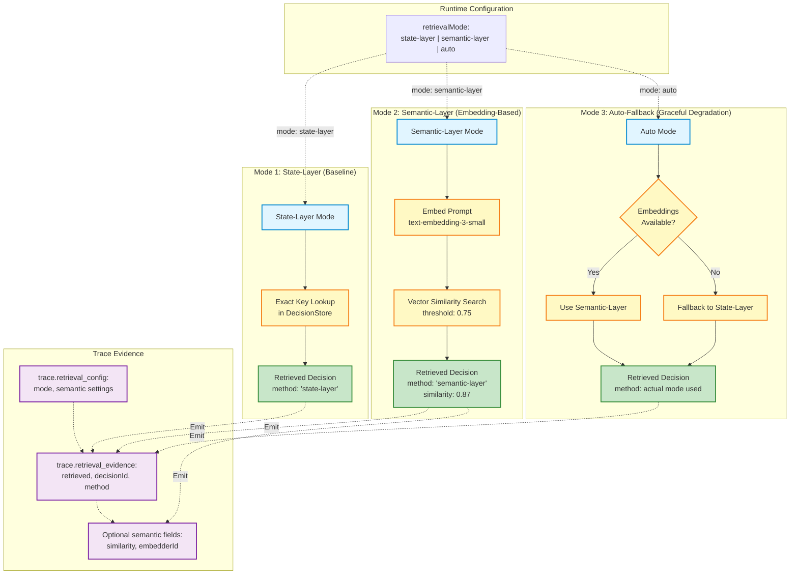

# Semantic Retrieval Modes: State-Layer vs Semantic-Layer vs Auto-Fallback

This diagram shows the three retrieval modes in PCSRuntime and how auto-fallback provides graceful degradation when embeddings are unavailable.



## Mode Comparison

| Feature | State-Layer | Semantic-Layer | Auto-Fallback |
|---------|-------------|----------------|---------------|
| **Mechanism** | Exact key lookup | Vector similarity | Try semantic, fallback to state |
| **Requires Embeddings** | No | Yes | No (graceful degradation) |
| **Trace Method** | `'state-layer'` | `'semantic-layer'` | Actual mode used |
| **Similarity Score** | N/A | Yes (0.0-1.0) | Only if semantic used |
| **Embedder ID** | N/A | Yes | Only if semantic used |
| **Use Case** | Exact match retrieval | Fuzzy/semantic match | Production resilience |

## Mode 1: State-Layer (Baseline)

### Configuration
```javascript
const runtime = new PCSRuntime({
  retrievalMode: 'state-layer'
});
```

### Behavior
1. Exact key-based lookup in DecisionStore
2. No embedding computation
3. Fast, deterministic retrieval

### Trace Evidence
```javascript
{
  "retrieval_config": {
    "mode": "state-layer",
    "semantic": {
      "enabled": false
    }
  },
  "retrieval_evidence": {
    "retrieved": true,
    "decisionId": "decision-abc123",
    "source": "substrate",
    "method": "state-layer"
  }
}
```

### When to Use
- Exact match retrieval is sufficient
- No embeddings infrastructure available
- Deterministic behavior required
- Baseline for comparison

## Mode 2: Semantic-Layer (Embedding-Based)

### Configuration
```javascript
const runtime = new PCSRuntime({
  retrievalMode: 'semantic-layer',
  semanticRetrieval: {
    enabled: true,
    threshold: 0.75,
    embedderId: 'text-embedding-3-small',
    dimensions: 1536
  }
});
```

### Behavior
1. Embed prompt using configured embedder
2. Vector similarity search in DecisionStore
3. Return decisions above similarity threshold
4. Include similarity score in trace

### Trace Evidence
```javascript
{
  "retrieval_config": {
    "mode": "semantic-layer",
    "semantic": {
      "enabled": true,
      "threshold": 0.75,
      "embedderId": "text-embedding-3-small",
      "dimensions": 1536
    }
  },
  "retrieval_evidence": {
    "retrieved": true,
    "decisionId": "decision-abc123",
    "source": "substrate",
    "method": "semantic-layer",
    "similarity": 0.87,
    "embedderId": "text-embedding-3-small"
  }
}
```

### When to Use
- Fuzzy/semantic matching needed
- User queries may vary in phrasing
- Embeddings infrastructure available
- Higher recall desired

## Mode 3: Auto-Fallback (Graceful Degradation)

### Configuration
```javascript
const runtime = new PCSRuntime({
  retrievalMode: 'auto',
  semanticRetrieval: {
    enabled: true,  // Try semantic first
    threshold: 0.75,
    embedderId: 'text-embedding-3-small',
    dimensions: 1536
  }
});
```

### Behavior
1. Check if embeddings are available
2. If yes: Use semantic-layer
3. If no: Fall back to state-layer
4. Trace shows actual mode used

### Trace Evidence (Semantic Available)
```javascript
{
  "retrieval_config": {
    "mode": "auto",
    "semantic": {
      "enabled": true,
      "threshold": 0.75,
      "embedderId": "text-embedding-3-small",
      "dimensions": 1536
    }
  },
  "retrieval_evidence": {
    "retrieved": true,
    "decisionId": "decision-abc123",
    "source": "substrate",
    "method": "semantic-layer",  // Actually used semantic
    "similarity": 0.87,
    "embedderId": "text-embedding-3-small"
  }
}
```

### Trace Evidence (Semantic Unavailable)
```javascript
{
  "retrieval_config": {
    "mode": "auto",
    "semantic": {
      "enabled": true,
      "threshold": 0.75,
      "embedderId": "text-embedding-3-small",
      "dimensions": 1536
    }
  },
  "retrieval_evidence": {
    "retrieved": true,
    "decisionId": "decision-abc123",
    "source": "substrate",
    "method": "state-layer"  // Fell back to state-layer
  }
}
```

### When to Use
- Production environments (resilience)
- Embeddings may be temporarily unavailable
- Want semantic when available, state-layer as backup
- Transparent fallback behavior

## EVS-7 Test Coverage

### Test 1: State-Layer Mode
```javascript
const runtime = new PCSRuntime({
  retrievalMode: 'state-layer'
});

// Assertions:
// - retrieval_config.mode === 'state-layer'
// - retrieval_evidence.method === 'state-layer'
// - No similarity/embedderId fields
```

### Test 2: Semantic-Layer Mode
```javascript
const runtime = new PCSRuntime({
  retrievalMode: 'semantic-layer',
  semanticRetrieval: { enabled: true, threshold: 0.75 }
});

// Assertions:
// - retrieval_config.mode === 'semantic-layer'
// - retrieval_evidence.method === 'semantic-layer'
// - similarity and embedderId fields present
```

### Test 3: Auto-Fallback Mode
```javascript
const runtime = new PCSRuntime({
  retrievalMode: 'auto',
  semanticRetrieval: { enabled: true, threshold: 0.75 }
});

// Assertions:
// - retrieval_config.mode === 'auto'
// - retrieval_evidence.method is either 'state-layer' or 'semantic-layer'
// - Actual mode used is trace-visible
```

## Why This Matters

### 1. **Semantic Retrieval is a Runtime Primitive**
- Not a library or plugin
- Built into PCSRuntime
- Distinct code path with trace evidence

### 2. **Mode Selection is Runtime-Controlled**
- Test doesn't implement retrieval logic
- Runtime decides which mode to use
- Trace proves which mode was used

### 3. **Auto-Fallback Enables Resilience**
- Embeddings temporarily unavailable? No problem
- Workflow continues with state-layer
- Transparent to user

### 4. **Foundation for Higher-Layer Primitives**
- **EVS-10:** Contextual Salience Engine (uses semantic retrieval)
- **EVS-11:** Meta-Programming Interface (uses semantic retrieval)
- **Vision Drift Prevention:** Semantic alignment checks

## Architectural Proof

**EVS-7 proves:**

1. **Semantic-layer exists as a distinct primitive**
   - Separate code path from state-layer
   - Different trace evidence
   - Not just "better state-layer"

2. **Retrieval mode is runtime-controlled**
   - Test uses runtime APIs only
   - No custom retrieval logic in test
   - Trace evidence proves mode

3. **Auto-fallback works gracefully**
   - No error when embeddings unavailable
   - Falls back to state-layer
   - Trace shows actual mode used

**This is architectural validation, not linguistic validation.**

## See Also

- **EVS-7 Executive Summary:** Full test documentation
- **EVS-3:** Engine Replacement (uses retrieval for continuity)
- **EVS-6:** Development Continuity (uses retrieval for session persistence)
- **PCSRuntime Boundary Diagram:** Core architecture
